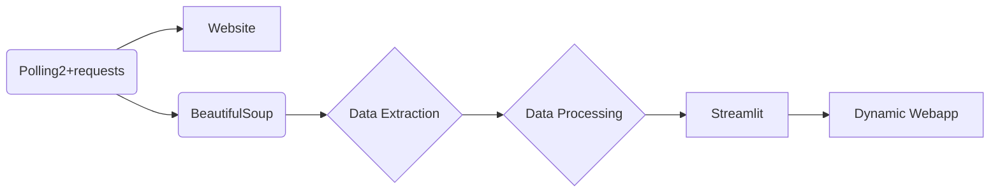

# African Cup of Nations 2024 Results Scraper

This project is a Python script that scrapes the results of the African Cup of Nations 2024 from the Eurosprt website.


It is automatically refreshed (uses polling).



## Getting Started

These instructions will get you a copy of the project up and running on your local machine for development and testing purposes.

### Prerequisites

You need to have Python installed on your machine. You can download Python [here](https://www.python.org/downloads/).
Tested with Python 3.12

### Installing

1. Clone the repository:
    ```sh
    git clone <repository_url>
    ```
2. Navigate to the project directory:
    ```sh
    cd <project_directory>
    ```
3. Install the required packages:
    ```sh
    pip install -r requirements.txt
    ```

## Running the Script

To run the app, use the following command:

```sh
streamlit run app.py
